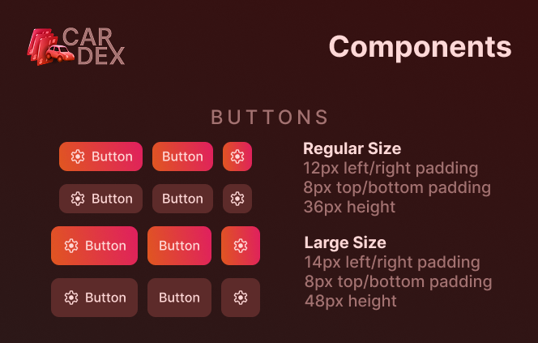

# Button Component System

CARDEX's custom Button components, showcased using our **FFPU system**.

## Prelude - Initial mockups
<p align="center">
  
</p>

</br>

## F - Files
- **Button.tsx** - Button component with TypeScript types
- **Button.module.css** - Button stylesheet
- **Demo.tsx** - Demo of all button variants

</br>

## F - Features

### Sizes
- **Regular**: 36px height, 12px horizontal padding, 8px vertical padding
- **Large**: 48px height, 14px horizontal padding, 8px vertical padding

### Variants
- **Primary**: Gradient (--gradient-light1 → --gradient-light2)
- **Secondary**: Dark brown (--block-secondary)

### Button Types
1. **Icon + Text**: Button with icon on the left and text
2. **Text Only**: Button with just text
3. **Icon Only**: Square button with just an icon

## P - Properties

```typescript
type ButtonProps = 
{
  children?: React.ReactNode;           // Button text
  size?: "regular" | "large";           // Default: "regular"
  variant?: "primary" | "secondary";    // Default: "primary"
  icon?: React.ReactNode;               // Icon element
  iconOnly?: boolean;                   // Make button square (icon only)
  onClick?: () => void;                 // Click handler
  disabled?: boolean;                   // Disabled state
  type?: "button" | "submit" | "reset"; // HTML button type
  className?: string;                   // Additional CSS classes
};
```

## U - Usage

### Basic Buttons
```tsx
import Button from "./Button";

// Regular primary button
<Button>Click Me</Button>

// Large secondary button
<Button size="large" variant="secondary">
  Save Changes
</Button>

// With click handler
<Button onClick={() => alert("Clicked!")}>
  Submit
</Button>
```

### Buttons with Icons
```tsx
// Icon + Text
<Button icon={<SettingsIcon />}>
  Settings
</Button>

// Icon Only (square button)
<Button icon={<SettingsIcon />} iconOnly />

// Using emoji as icon
<Button icon={<span>⚙️</span>}>
  Configure
</Button>
```

### Size Variants
```tsx
// Regular size (36px height)
<Button size="regular" variant="primary">
  Regular Button
</Button>

// Large size (48px height)
<Button size="large" variant="primary">
  Large Button
</Button>
```

### Color Variants
```tsx
// Primary (gradient)
<Button variant="primary">
  Primary Action
</Button>

// Secondary (dark)
<Button variant="secondary">
  Secondary Action
</Button>
```

### Disabled State
```tsx
<Button disabled>
  Disabled Button
</Button>

<Button variant="secondary" disabled>
  Can't Click
</Button>
```

### Form Buttons
```tsx
<form onSubmit={handleSubmit}>
  <Button type="submit" variant="primary">
    Submit Form
  </Button>
  
  <Button type="reset" variant="secondary">
    Reset
  </Button>
</form>
```

## Real-World Examples

### Navigation Actions
```tsx
<Button 
  size="large" 
  variant="primary"
  onClick={() => navigate("/packs")}
>
  Open Pack
</Button>

<Button 
  size="regular" 
  variant="secondary"
  onClick={() => navigate("/garage")}
>
  View Garage
</Button>
```

### Card Actions
```tsx
<Button 
  size="regular" 
  variant="primary"
  icon={<span>⭐</span>}
  onClick={handleAddToFavorites}
>
  Favorite
</Button>

<Button 
  size="regular" 
  variant="secondary"
  onClick={handleTrade}
>
  Trade
</Button>
```

### Toolbar Buttons
```tsx
<div style={{ display: "flex", gap: "8px" }}>
  <Button 
    size="regular" 
    variant="secondary"
    icon={<span>⚙️</span>}
    iconOnly
  />
  <Button 
    size="regular" 
    variant="secondary"
    icon={<span>🔍</span>}
    iconOnly
  />
  <Button 
    size="regular" 
    variant="secondary"
    icon={<span>📊</span>}
    iconOnly
  />
</div>
```