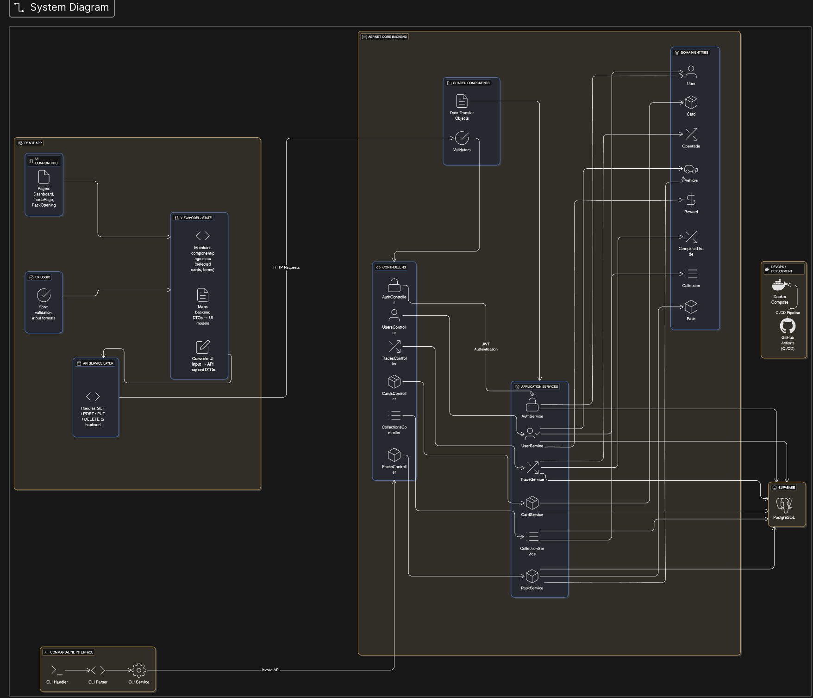
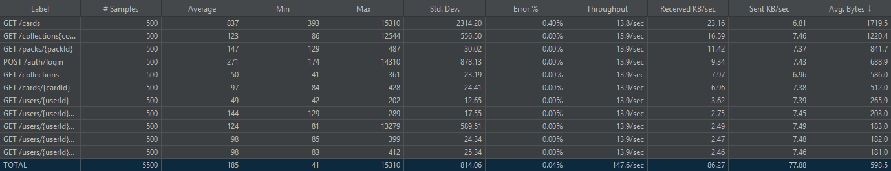

# Sprint 2 - Worksheet

 

## 1. Regression Testing

 
 

## 2. Testing Slowdown
We have kept all of our unit and integration tests from the original testing plan. 
However, a few of our test assertions had to be updated after we introduced string localization with the .resx files.
Since some messages are now pulled from localized resources instead of hardcoded strings, a few expected values in the tests had to be changed to match the new localized outputs.

We have not created separate test plans for different release types, the only separation is between Frontend and Backend testing. Right now, the tests all run together for every commit, which keeps things simple and ensures that everything is covered no matter what we release.

### Frontend
Thanks to the TestingEngine serving as a baseline for test coverage and syntax, we have maintained the standard set out in our testing plan, regarding our ReactEngines.

We hadn't yet decided on the second frontend when we wrote the testing plan, but we did attempt to follow the same testing naming conventions. That is, the logical grouping of frontend testing, as used in the React engines. However, since we used `pytest`, our test output displays in pytest-format, so it doesn't match exactly.

 
 

## 3. Not Testing

The following parts of the code haven't been tested:
| Component | Tested | Untested | Coverage | Testing Level |
|----------|----------|----------|----------|----------|
| Frontend Services | 0/6 | 6/6 | 0% | Not tested |
| Frontend Context | 1/3 | 1/3 | 33% | Mostly tested |

The frontend coverage report can be found in CarDex\CarDexFrontend\coverage\lcov-report\index.html

 
 

## 4. Profiler

`GET /cards` is the slowest endpoint. It currently returns all cards in a single response, which means latency will only grow as we add more cards. 

A potential fix is to add pagination to the response so that we are only returning the cards in batches as they get requested.  

 
 

## 5. Last Dash
For the final sprint, our communication will make or break the project. We have had many issues with communicating solid timelines for certain project aspects, and thus will need to have strong cohesion to ensure the full project delivery.

### We anticipate scope creep.
As the application functions are getting bigger and complex than expected, we may not be able to complete all the targets that we aimed for at the start of the course.

### We also will most likely revise some User Stories.
These included way too much detail / nuance then our app will end up having. Therefore, we will need to focus on meeting the core acceptance criteria before checking off the more complicated ones.
 

 
 

## 6. Show Off

### Alejandro
#### 1. [Created second frontend, the CARDEX CLI. Cleaned up TextInput component.](https://github.com/VSHAH1210/CarDex/commit/689679b16755d7751daa42d12dd9e99545050c37)  
This commit was the result of a few days of working locally to build the entire second frontend. I started by brainstorming with AI to plan out the python filestructure, alongside creating an api client that supported mock testing and easy (future) endpoint connection. We landed on 4-5 core functionalities of the CLI, attempting to mimic a "Companion App" of real trading card games. It follows that I wrote >50 test cases for this CLI, achieving >99% test coverage. They handle input validation, api responses, display output and more. Thiis Frontend is ready for real endpoint plug in for next sprint!
#### 2. [Global styles in App.css](https://github.com/VSHAH1210/CarDex/commit/e9f6f1d4b385898c47c403477e16c41b4978547a)  
Although this commit looks small, it was a small portion of the full app design effort I have been making since sprint 0. As such, this commit was the creation of the global stylesheet for our React app, which took all my Figma designs, typography, and colours and made them reusable css classes for our app.

### Ansh
#### [Add frontend infrastructure: API services, state management, and hooks](https://github.com/VSHAH1210/CarDex/commit/5c564ca85360b074db41b05ca92e52e30bda63c0)  
The above commit is what I am most proud of. The thinking and brainstorming of how I could do this was interesting, frustrating and exciting to see it work.  I learnt so much about frontend as I have not worked this deeply in frontend before so I wasn’t an expert but understanding why we need some of these code files and techniques was interesting to learn and understand.

### Vansh
#### [Create the register page](https://github.com/VSHAH1210/CarDex/commit/ff46a374c5c48cfda9cf0845d260fae19392c76c)  
I’m most proud of creating our app’s registration page, my first time ever building something in React, and I’m proud of it because I stepped into a brand-new framework, owned the whole flow from start to finish, and delivered a simple, welcoming experience that helps people get into the app without friction. It unlocked onboarding for our team, reduced confusion for new users, and set a clear, consistent pattern we can reuse for future forms. Seeing my group members use it confidently was a big win and showed me I can learn fast, make thoughtful design choices, and ship work that feels polished and high-impact.

### Ian
#### [feat(localization): add centralized .resx-based string localization for API and Services](https://github.com/VSHAH1210/CarDex/commit/1ad9b4b6394970cbb70a302a103d50cc20e1d660)  

I’m proud of setting up string localization with SharedResources.resx. It cleaned up a bunch of hardcoded strings across the backend and made everything way easier to manage, and will make it easier going forward. It felt great seeing the API return proper localized messages, and it sets us up nicely if we ever want to support multiple languages later on.

### Jotham
#### [Created BrowserRoutes for Navigation, Garage, and PackShop; modified App.tsx](https://github.com/VSHAH1210/CarDex/commit/e304a5331d5c655e908e16dc44a4f48b23267245)

The commit I’m most proud of is when I created the BrowserRoutes and wired together the main page components — Navigation, Garage, and PackShop — through App.tsx. This involved connecting multiple components, managing how data flowed through props, and ensuring everything rendered dynamically from our mock JSON files. It was challenging to structure the app so each component communicated smoothly while maintaining clean, modular code, but seeing the pages interact seamlessly felt like bringing the whole frontend to life. It taught me a lot about how React routing, props, and component composition work together to create a fully functional, scalable interface.

Subhash - [JWT Authentication, Rate Limiter, Regression Testing script and suite](https://github.com/VSHAH1210/CarDex/commit/bf19486ee01572b547c3abff3ebd9ed2edbd212c)(https://github.com/VSHAH1210/CarDex/commit/2de6e2d63bd5a20c075139a71f2146a77fa956ec)(https://github.com/VSHAH1210/CarDex/commit/f8e1ce1608b2cebfd94418c6ef790e4f90a6fe43)
- I am proud of implementing the JWT authentication for better security and Rate Limiter for not being the backend overhelmed by api requests and also api not being abused. Then I created the regression script which checks if the new functionality breaks the previously implemented ones. 

 
 
