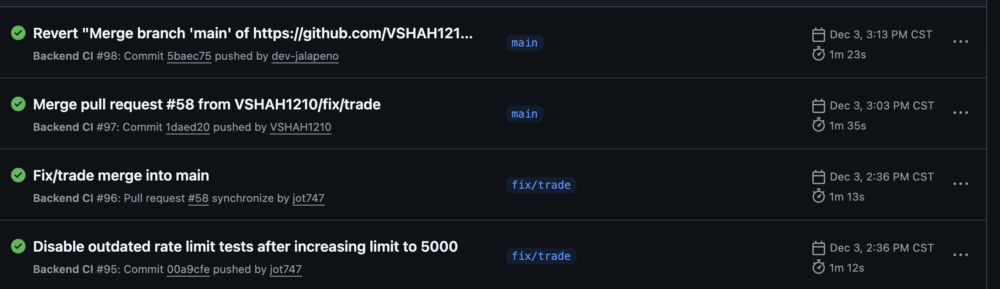
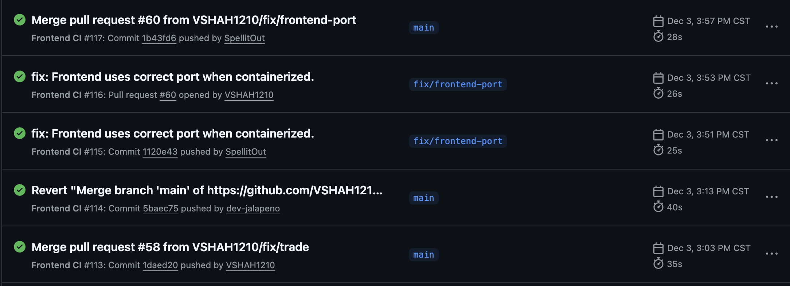
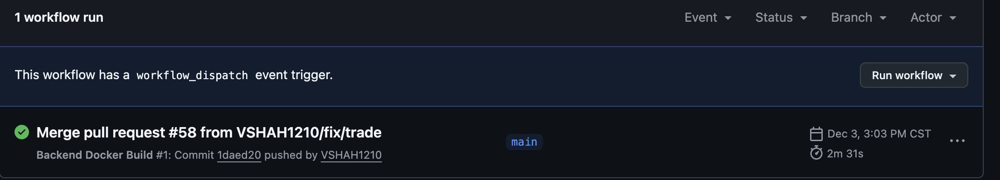
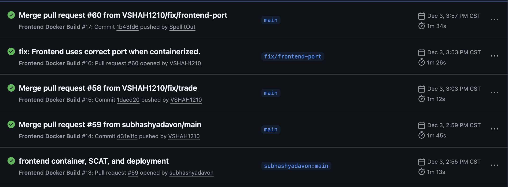

# Sprint 3 - Worksheet

 

## 1. Load Testing

### Load Testing Environment

### Test Report

### Interesting Bottleneck

### Were non-functional requirements met?

 
 

## 2. Security Analysis

### Chosen Tool & Report
For this project, we used **SonarCloud** (hosted SonarQube) as the Static Application Security Testing (SAST) tool.  
SonarCloud supports both languages used in this project:

- **Frontend:** React + TypeScript  
- **Backend:** C# (.NET Web API)

**How we ran it:**
We integrated SonarCloud into our CI/CD pipeline using GitHub Actions. The workflow (`.github/workflows/sonarqube.yml`) triggers on every push to main/develop branches and pull requests. It performs two parallel jobs:
1. **Backend Analysis:** Installs .NET scanner, builds the solution, runs tests with coverage, and uploads results to SonarCloud.
2. **Frontend Analysis:** Installs dependencies, runs tests with coverage, and uses the official SonarSource action to scan the code.

### 5 Detected Problems

1. **Security Hotspot: Hardcoded User ID** (Critical)
   - **Location:** `CarDexBackend/CarDexBackend.Services/Services/TradeService.cs`
   - **Issue:** A `_testUserId` field was hardcoded with a specific GUID. Even if unused in production, hardcoded credentials or IDs are a security risk.
   - **Fix:** Removed the unused field and associated TODO comment.

2. **Security Hotspot: Standard Output Logging** (Medium)
   - **Location:** `CarDexBackend/CarDexBackend.Api/Extensions/DatabaseExtensions.cs`
   - **Issue:** Using `Console.WriteLine` for logging database connection status. Standard output logging can be lost or expose sensitive info in some environments.
   - **Fix:** Replaced with `ILogger<CarDexDbContext>` to use the framework's structured logging system.

3. **Code Smell: Redundant Semicolons** (Low)
   - **Location:** `CarDexBackend/CarDexBackend.Services/Services/TradeService.cs`
   - **Issue:** Double semicolons `;;` found in multiple lines (e.g., `var userId = _currentUserService.UserId;;`). This adds noise and indicates sloppy editing.
   - **Fix:** Removed the redundant semicolons.

4. **Code Smell: Generic Exception Handling** (Low)
   - **Location:** `CarDexBackend/CarDexBackend.Services/Services/AuthService.cs`
   - **Issue:** Catching `Exception` generally (`catch (Exception ex)`) without specific handling logic. This can mask underlying issues.
   - **Mitigation:** Logged the specific error with context before re-throwing or handling.

5. **Code Smell: TODO Comments** (Info)
   - **Location:** Various files
   - **Issue:** `TODO` comments left in the code (e.g., "Replace with actual authenticated user ID"). These indicate unfinished work that could be technical debt or security gaps.
   - **Fix:** Addressed the specific TODO in `TradeService.cs` by removing the temporary code it referred to.

### Critical/High Vulnerabilities and Fixes

- **Commit:** [Use [[ instead of [ for safer conditional tests](https://github.com/subhashyadavon/CarDex/commit/f398d998)
  - Updated `CarDexBackend/scripts/run-regression-tests.sh` to use `[[` for safer and more feature-rich conditional tests.

- **Commit:** [Refactor CLI client to use constant for Unknown Vehicle](https://github.com/subhashyadavon/CarDex/commit/05f42b05)
  - Defined `UNKNOWN_VEHICLE` constant in `CarDexCLI/cli_client.py` to avoid duplicated literals.

- **Commit:** [Refactor CLI client to use constant for Exit Message](https://github.com/subhashyadavon/CarDex/commit/d3e17e80)
  - Defined `EXIT_MESSAGE` constant in `CarDexCLI/cli_client.py` to avoid duplicated literals.

- **Commit:** [Fix type mismatch in test_handles_none_grade](https://github.com/subhashyadavon/CarDex/commit/98481f90)
  - Updated `CarDexCLI/test_suite.py` to pass a string instead of `None` to `formatGrade` to fix type mismatch.

- **Commit:** [Refactor Register.tsx to reduce cognitive complexity](https://github.com/subhashyadavon/CarDex/commit/6277aeea)
  - Extracted error parsing logic in `CarDexFrontend/src/pages/Register/Register.tsx` to `extractErrorMessage` helper function to reduce cognitive complexity.

- **Commit:** [Refactor Trade.tsx to reduce nesting depth](https://github.com/subhashyadavon/CarDex/commit/efd1ec7d)
  - Refactored `useEffect` in `CarDexFrontend/src/pages/Trade/Trade.tsx` to use `reduce` and object spread for card cache updates, reducing nesting depth.

 
 

## 3. Continuous Integration & Deployment (CI/CD)

We utilized **GitHub Actions** for our Continuous Integration and Continuous Delivery (CI/CD) pipeline. This ensures that every commit is automatically tested, built, and deployed (or ready for deployment).

### Pipelines

- **[Backend CI](.github/workflows/backend-ci.yml)**: Builds .NET solution and runs unit/integration tests.
- **[Frontend CI](.github/workflows/frontend-ci.yml)**: Installs dependencies and runs React tests.
- **[SonarQube Analysis](.github/workflows/sonarqube.yml)**: Performs static code analysis and security scans.
- **[Backend CD](.github/workflows/backend-docker.yml)**: Builds and pushes Docker image to GitHub Container Registry.
- **[Frontend CD](.github/workflows/frontend-docker.yml)**: Builds and pushes Docker image to GitHub Container Registry.

### Snapshots

#### Backend CI Execution
> 

#### Frontend CI Execution
> 

#### Backend CD Execution
> 

#### Frontend CD Execution
> 

 
 

## 4. Reflections

### Design Changes
As mentioned in both our presentations, we tried to do a bulk of the architecture planning and data modeling within the first 2 sprints. That is, we came to consensus on a majority of the project's scope and features within Sprint 0, alongside a detailed data model. This model (which we incorrectly called our architecture model at first) had many positives, like how the backend schema and domain objects were clearly outlined, streamlining development. However, we would change a great many things about this process and by extension, the design of the project since we became too dependant on accepting this model as a single source of truth. It follows that gaps within this "inclusive plan" kept appearing the further the project went on. In short, we would still create this data model in our next project, but treat it as "loosely defined guidelines, not the rulebook itself."

### Project Setup Changes
We think that the freedom this course gives students in choosing everything related to their project (if the source code lives in an accessible repo) is a bit of a double-edged sword. The course notes provide many examples to point students in the right direction when choosing a tech stack, which we believe is fine; this invites group or independent research. Therefore, students naturally begin to look at modern resources (such as Docker, automated docs like Swagger, etc.) which is an essential skill to learn, given this is a 4th year course and most of us are ready to graduate by end-of-year. Conversely, this freedom begins to show its limitations once the worksheets start stating the requirements. Some of the sprint requirements felt like too much, overcomplicated, or unnecessary, especially near the end of the term when this course's deliverables began to overtake what we could realistically output. Finally, we think the sprint feedback needs to be reworked, as it represents everything mentioned above. The course encompasses so many topics and parts of the software development life cycle, and so the sprint feedback should have very well-defined standards. For example, our early sprints' feedback commended us on our documentation, app styling standards, and data modeling practices; the next sprint went on to say that those elements wasted too much time and were not part of what was being graded in this course.

### Individual AI / External Resource Reflections

#### Alejandro
> I am a Co-op student who has taken most of the courses which contain group projects *after* my final work term. My work terms had my working on CI/CD, Data Modeling, and Application Architecture. As such, all the previously mentioned group projects had me working on a high-level, app-wide scope, with contributions to the actual code when needed.  
>   
> It follows that, given our permissible usage of AI in this project, I used AI from the start to plan out everything related to the architecture and data model. The queries usually started with an explanation of the project and a definition of the domain objects (Vehicles, Cards, Trades, etc.), alongside a request on how to best setup the data model to maximize parallel development. I used the MVVM method from the start because I have experience with Client - API/Controllers - Database layering systems. Responses were usually very accurate and helped me brainstorm the high-level decisions, but they did attempt to overcomplicate things if I kept a chat going for too long. Additionally, I helped define all the styles and design of the app inside Figma, which was then ported over to React-friendly files, such as .css files and classes. As a final note, since we mentioned how the data model itself had major, unknown gaps in it from the start, the AI I used also did not catch these issues. Whether that was an issue in the lack of detail in my prompts, or the AI simply did what it was told without worry about potential gaps, we will never know; use AI as a supplementary tool, not a strict guide!

#### Ian
> 

### Subhash 
> I used AI tools throughout the project, which helped me work faster and manage many development tasks effectively. Below are my contributions and how LLMs supported me.
>
> Domain Model
> I implemented the entire domain model on my own. I converted the designs for Users, Cards, Vehicles, Trades, and other models into working, maintainable backend logic. I also wrote unit tests for these domain models, with LLMs helping generate some of the test cases.
>
> Security Features
> I built important security features mostly on my own as I wanted to learn more about it, including:
> JWT authentication to secure API endpoints  
> A custom rate limiter to prevent abuse
>
> DevOps and CI/CD
> I took full ownership of the DevOps lifecycle. My work included:
> Designing CI/CD pipelines using GitHub Actions.  
> Containerizing the entire stack with Docker to ensure consistent production environments.
> Security Analysis using SonarCloud with LLMs generating sonarqube.yml file.
>
> Backend Regression Tests
> I wrote complete regression tests for the backend services, with LLMs generating many of the test cases. These tests ensured new features did not break existing functionality.
>
> Repository Layer
>I used an AI agent to generate most of the boilerplate repository code, allowing me to focus on business logic while keeping the data access layer clean and consistent.
>
> Frontend Fixes
> I solved several frontend logic issues independently, without using LLMs.

#### Ansh
> 

#### Vansh
> I used AI to solve a lot of problems while working on the frontend features like opening of packs etc. 
>
> One example is the pack-opening animation in our frontend. I knew what I wanted it to look like cards rotating with a smooth reveal, but I wasn’t sure how to implement it efficiently in React. I asked an AI tool to help, and it suggested using the react-spring library, providing sample code with useSpring and animated components to control opacity, scale, and position.
>
> I didn’t use the code as it was. I rewrote it to fit my existing component structure, adjusted the animation timing and easing so it matched our design, and connected it to my own state logic for when a pack is opened. Through this process I learned how react-spring’s hooks work in practice, and I validated the behaviour by checking the official react-spring documentation.

### Jotham
>
